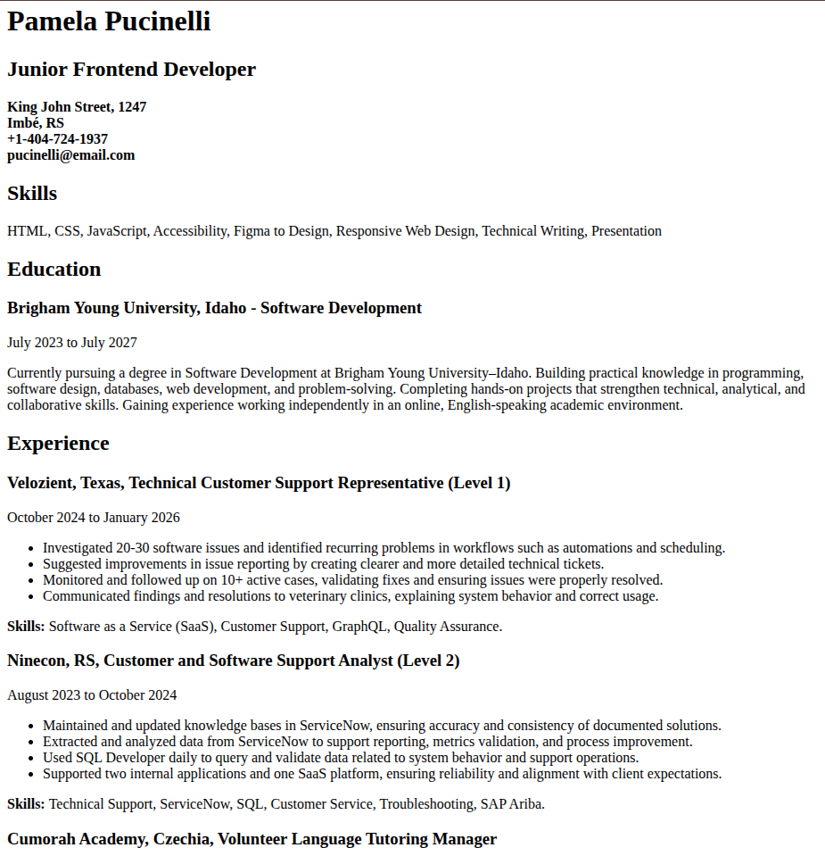

---
# 🚀 roadmap.sh Frontend Projects

A collection of frontend projects created while following the  
[Frontend Developer Roadmap](https://roadmap.sh/frontend).

These projects are part of my learning journey and help me practice building
accessible, responsive, and user-friendly web interfaces.

---

## 📚 About This Repository

This repository contains my solutions to frontend projects proposed by
[roadmap.sh](https://roadmap.sh/projects). The projects will become more advanced as I progress through the roadmap.

---

## 🗂️ Projects

Click a project thumbnail to open its live demo!

<!-- 

**Project:** [#](#)  
**Technologies:** `#`.   -->

### 01 — Single-Page CV

**Project:** [View challenge on roadmap.sh](https://roadmap.sh/projects/single-page-cv)  
**Technologies:** `HTML`.  

---

## 🛠️ Technologies

The technologies used will vary between projects.

  

---

## 🌐 Live Projects

The completed projects are published using
[GitHub Pages](https://pages.github.com/).

---

Made with 💻, curiosity, and continuous practice.

